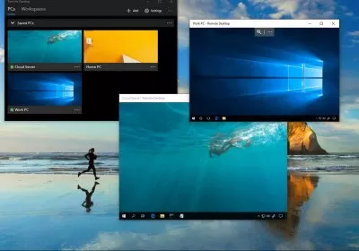

# 📰 Q/Hub — A Clean & Responsive Blog Website

Welcome to **Q/Hub**, a simple blog-style website where engaging articles meet elegant design. Built with pure HTML and CSS, this project is perfect for exploring UI fundamentals and building a static content-driven site.

---

## 🚀 Live Demo
Coming soon: Deploy on **GitHub Pages** or **Vercel** to make it live!

---

## 📌 Features

- 🔎 Responsive navbar with search functionality  
- ✨ Stylish homepage with featured articles  
- 💡 Modular CSS with reusable classes (`utils.css`)  
- 📱 Fully responsive design with `mobile.css`  
- 🔗 Article links to real-world tech news (for demo)

---

## 🛠️ Tech Stack

- **HTML5** — Semantic and structured markup  
- **CSS3** — Custom styles and responsive utilities  
- Optional deployment via **GitHub Pages**, **Vercel**, or **Netlify**

---

## 🗂️ Folder Structure

---

## 📷 Preview

---

## 📚 Credits

- Article previews from [TechSpot](https://www.techspot.com/)  
- Icons/Images from [Vecteezy](https://www.vecteezy.com/)

---

## 📬 Contact

Crafted with 💙 by **Suraj Bisht**  
📍 [GitHub Profile](https://github.com/SurajBisht7)

---

Let me know if you want to embed deployment badges, or auto-link your live site when you publish it!
